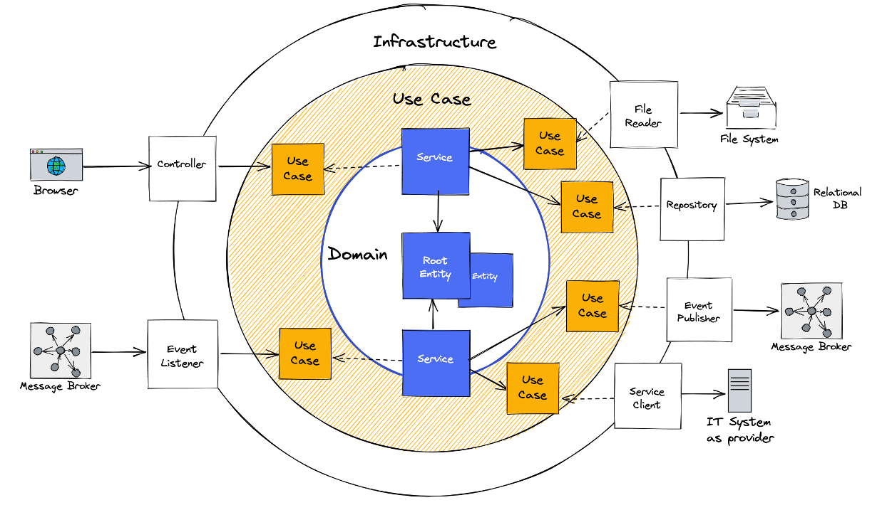
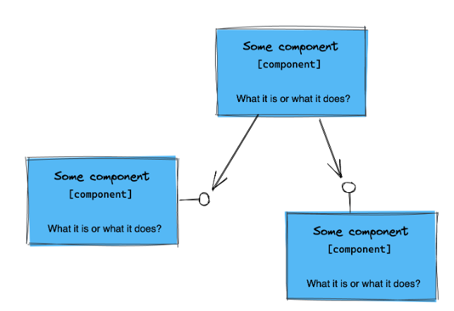
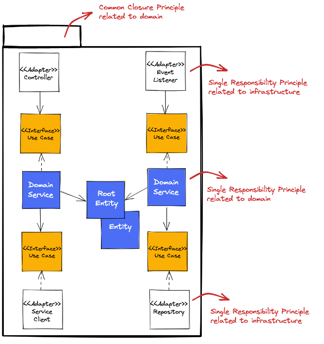
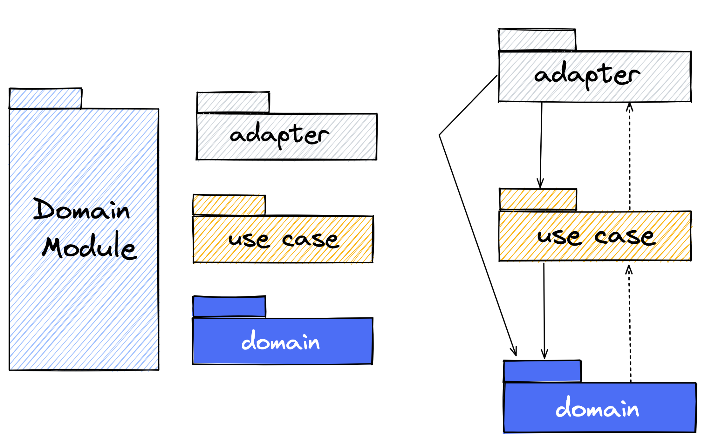
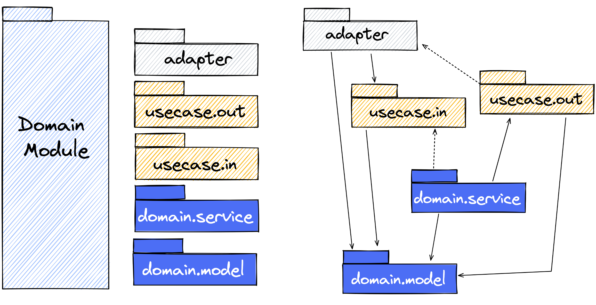
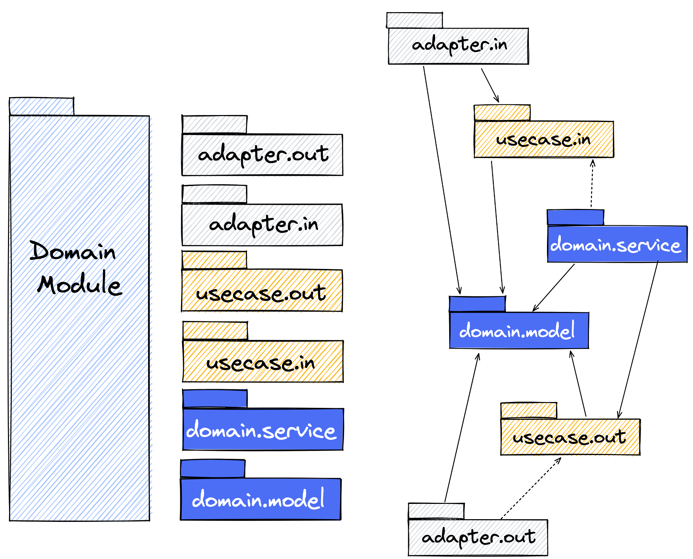

+# Lab 1 Clean Architecture Pattern, Modularization, SOLID and Domain Modules

## General Information

Please follow the package, class, and method names as described in the exercises.

## Clean Architecture Pattern and Underlying Design Principles

### Clean Architecture Pattern

Look at ring model of the clean architecture pattern. Try to understand the fundamental separation of the domain and the
infrastructure.



**True or false?**

1. The infrastructure provides interfaces which the domain can implement.
2. Adapter implementations (aka adapters) are located within the infrastructure ring and are responsible to integrate
   and access infrastructure components (e.g. file system, http in- and outbund).
3. The domain only depends on use cases located in the use case ring.
4. The domain provides interfaces which will be implemented by adapters.
5. Use case definitions are driven by adapters.
6. The use case ring connects the infrastructure and the domain.
7. Use case definitions are driven by domain.

[Solution](Exercise1-true-false-solution.md)

### Common Closure and Separation of Concerns

The _common closure principles_ says:

---
_The classes of a package should be closed together against the same kind of changes. A change that affects a package
affects all the classes in that package and no other package._

Wait a minute and think about what "same kind of changes" means.

...

Some people also say that the _common closure principle_ describes the _single responsibility principle_ for packages.
The reason is that the same kind of changes is in most cases related to functional or domain-related requirements.

The conclusion is that the package should be sliced vertically by domain object and functions (e.g. vehicle) and not
horizontally by technical characteristics (e.g. controller or services). There is another principle, the so-called _
separation of concerns_, which describes the same idea.

_Separation of concerns_:

---
Separate different aspects of a problem and manage every sub-problem on its own. Based on this create semantical chunks,
so that the complexity of each chunk can be handled easier.



### Single Responsibility and SOLID

The single responsibility principle says:

---
_There should never be more than one reason for a class to change!
Tom DeMarco & Meilir Page-Jones_

In comparison to the common closure principle and separation of concerns, which affects the package level, the single
responsibility principle affects the class level.

This is also the case for the other principles of SOLID. SOLID stands for

* **single responsibility principle**
* open closed principle
* liskov substitution principle
* **interface segregation principle**
* **dependency inversion principle**

During the training, we discuss the principles highlighted in bold and also some others that not belongs to SOLID
directly.

An associated goal is to separate technical and domain-related aspects within the common closure (_domain module_). This
could be reached by class stereotypes containing a clear task, that this stereotype has to do. For the clean
architecture pattern class stereotypes can look like follows:



We will meet all class-stereotype step by step.

## Package Structure Variants Within Clean Architecture Pattern

In the first step, you have to decide which package style you want to use.

There are several package structure variants, that can be applied within the clean architecture pattern:

* architectural expressive,
* architectural expressive domain or,
* rings by layers

Please select the variant you want to use in this training. Later we have a better feeling about that and we will
discuss the pros and cons.

The recommendation is to use **architectural expressive**. Because layers are something you are more familiar with and
in this variant the concepts of clean architecture pattern will become more visible to you.

### Rings as Layers

The _domain module_ is simple structure following the rings of the clean architecture pattern.



### Architectural Expressive Domain

In this variant the _use case ring_ i separated in incoming (_in_) and outgoing (_out_) use cases. The _domain ring_ is
separared in _service_ and _model_.



### Architectural Expressive

Additionally the adapter ring is also separated in sub-structure following the semantics of _in_ and _out_.



## Task 1.1: Implement a Self-Validating Domain Model

1. Create the root entity (or in DDD also called aggregate) <i>Vehicle</i> and place it in the designated package
2. Create the value object <i>Vin</i> and place it in the designated package
3. Ensure that the <i>Vehicle</i> can only be created with a valid vehicle identification number (vin)
4. A vehicle identification number is valid when the value follows the regex pattern below. Throw an
   IllegalStateException in case of a validations error.

```java

// examples
// WP0ZZZ99ZTS392155
// WBAOLZ99ZTS349156

"(?=.*\\d|=.*[A-Z])(?=.*[A-Z])[A-Z0-9]{17}"

```

### Verify your Implementation

1. Move the test _DomainModelTestExercise1.java_ from _exercises/tests/one_ to _
   src/test/java/com/daimler/dcp/clean/arc/demo/exercise/one_
2. Run _mvn clean install -DskipTests_
3. Execute _DomainModelTestExercise1.java_

## Task 1.2: Creaate the (Domain) Service for the Root Entity

1. Create the (domain) service <i>VehiclesService</i> and place it in the designated package
2. The <i>VehiclesService</i> should offer following method


```java

public Vehicle readVehicle(Vin vin) {...}

```

Currently, it is enough to return a hard-coded instance of the class <i>Vehicle</i>.

### Verify your Implementation

1. Move the test _DomainServiceTestExercise1.java_ from _exercises/tests/one_ to _
   src/test/java/com/daimler/dcp/clean/arc/demo/exercise/one_
2. Run _mvn clean install -DskipTests_
3. Execute _DomainServiceTestExercise1.java_

## Verify your Architecture

1. Move the test _ArchitectureTestExercise1.java_ from _exercises/tests/one_ to _
   src/test/java/com/daimler/dcp/clean/arc/demo/exercise/one_
2. Run _mvn clean install -DskipTests_
3. Execute _ArchitectureTestExercise1.java_