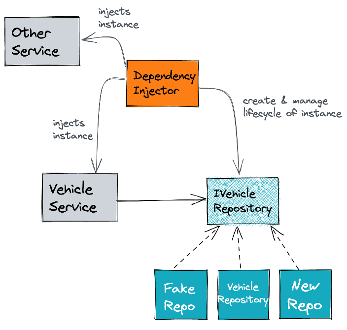

# Lab 2: Dependency Injection, Dependency Inversion Principle and the Ports & Adapters Pattern

## Dependency Injection

Dependency Injection is a pattern described as follows:

A central component, the dependency injector, manages the lifecycle of class instances and injects these instances into
several consumers.



Relevant types of dependency injection by example with java and spring:

```java

import org.springframework.beans.factory.annotation.Autowired;

public class Consumer {

    @Autowired //field injection
    private DependencyOne one;

    private DependencyTwo two;

    @Autowired // contructor injection
    public VehicleService(DependencyTwo two) {
        this.two = two;
    }

    @Autowired //method injection
    public void doSomething(DependencyThree three) {
        three.doSomething();
    }
}
```

In short, the goal of dependency injection is to reduce the coupling between a consumer and provider class by the
externalization of object creation and management of the object's lifecycle. So consumers can only focus on the usage of
this dependency. In combination with interfaces, the consumer will be decoupled from a provider-specific implementation. Both things
reduces the coupling between the involved classes.

[Futher informations about dependency injection](https://martinfowler.com/articles/dipInTheWild.html)

## Task 2.1: Create a HTTP Input Adapter and Connect It to the Domain

The class-stereotype <i>Controller</i> is the place to

* implement HTTP-based inbound into our application,
* wiring incoming use cases to execute domain functionality and,
* transform domain-related exceptions to HTTP status codes.

1. Create a <i>VehicleController</i> and place it in the designated package
2. Implement the REST endpoint <i>/vehicle/{vin}</i> and return a hard-coded vehicle object. Use following method
   signature and WP0ZZZ99ZTS392155 as value for the vin.

**Java**

```java

public Vehicle readVehicle(String vin) {...}

```

**Kotlin**

```kotlin

fun readVehicle(vin: String): Vehicle {...}

```

**C#**

```java

public VehicleRootEntity ReadVehicle(string vin) {...} 

```

3. Please ignore any framework specific annotations and configurations

## Task 2.2: Query About a Domain Object Using a Use Case

1. Create the incoming use case <i>VehicleQuery</i> with the method

**Java**

```java

Vehicle findByVin(Vin vin);

```

**Kotlin**

```kotlin

fun findByVin(vin: Vin): Vehicle

```

**C#**

```java

VehicleRootEntity FindByVin(string vin) {...} 

```

and place it in the designated package.

3. Replace the hard-coded <i>Vehicle</i> within <i>VehicleController</i> with the usage of <i>VehicleQuery</i>
4. The dependency between <i>VehicleController</i> and <i>VehicleQuery</i> should be resolved via _constructor injection_
5. Implement the incoming usecase <i>VehicleQuery</i> through _VehicleService_

### Verify Your Implementation

**RUN** _InputAdapter_Task_2_1_2_2_

### Verify Your Architecture

**RUN** _ArchitectureTest_Task_2_1_2_2_

## Dependency Inversion Principle

The dependency inversion principle says:

---
_Abstractions should not depend on details. Details should depend on abstractions._

The _VehicleService_ is a concrete implementation. This means it is a detail. Following the dependency inversion
principle, the _VehicleService_ should depend on an abstraction e.g. an interface. This interface will be implemented by
the provider of a functionality. As a result, there is no direct dependency on a specific implementation. The dependency
is inverted.


## Task 2.3: Introduce a Outgoing Use Case and Create a Database Adapter

The class-stereotype <i>Repository</i> is the place to

* wire a JdbcRepository or JpaRepository,
* connect to a database with plain jdbc,
* define and execute sql statements as well as
* handle sql errors.

1. Create the outgoing usecase <i>VehicleDbQuery</i> with the method
**Java**
```java

Vehicle findVehicleByVin(Vin vin);

```

**Kotlin**

```kotlin

fun findVehicleByVin(vin: Vin): Vehicle

```

**C#**

```java

VehicleRootEntity FindVehicleByVin(Vin vin) {...} 

```

2. Create the repository <i>VehicleRepository</i> and place it in the designated package
3. The repository should implement <i>VehicleDbQuery</i> and should return a hard-coded <i>Vehicle</i> instance
5. Replace the hard-coded <i>Vehicle</i> within <i>VehicleService</i> with the usage of <i>VehicleDbQuery</i>
6. The dependency between <i>VehicleService</i> and <i>VehicleDbQuery</i> should be resolved via _constructor injection_

### Verify Your Implementation

**RUN** _OutputAdapter_Task_2_3_

### Verify Your Architecture

**RUN** _ArchitectureTest_Task_2_3_

## Task 2.4: Additional Questions

For handling with persistence aspects spring-data-jpa or spring-data-jdbc uses annotations like
<i>@Entity</i>, <i>@Table</i>, <i>@Id</i>, <i>@Column</i>, etc. Often this concepts need also an empty constructor as
well as setter and getters for all properties.

```java

@Table("vehicle")  //jdbc
@Entity //jpa
public class Vehicle {

    @Column("vin")
    @Id
    private Vin vin;

    //...

    public Vehicle() {
    }

    public Vehicle(Vin vin) {
        //...
    }

    //getter and setter
}

```

1. Regarding the above code example answer following questions:
    1. Is the domain object _Vehicle_ decoupled from infrastructure aspects?
    2. Is it possible to ensure a valid creation of the domain object like implemented in Lab 1?
    3. Is there fully control that the domain object state stays valid over the lifetime of the object?
2. Is a value object a good structure for a relational database?
    1. What are benefits of a value object like the <i>Vin</i>?
3. How would you describe the relationship between dependency inversion and dependency injection?
4. How would you describe the single responsibility principles for the following classes? Make two or three bullet
   points for the scheme _The responsibility of 'NAME' with the stereoytpe 'TYPE' is:_
    1. <i>VehicleController</i>,
    2. <i>VehicleService</i>,
    3. <i>VehicleRepository</i> and
    4. <i>Vehicle</i>

Example:
The responsibility of _VehicleController_ with the stereoytpe _Controller_ is:

* ...
* ...
* ...

[Solution](Exercise2-additional-questions.md)