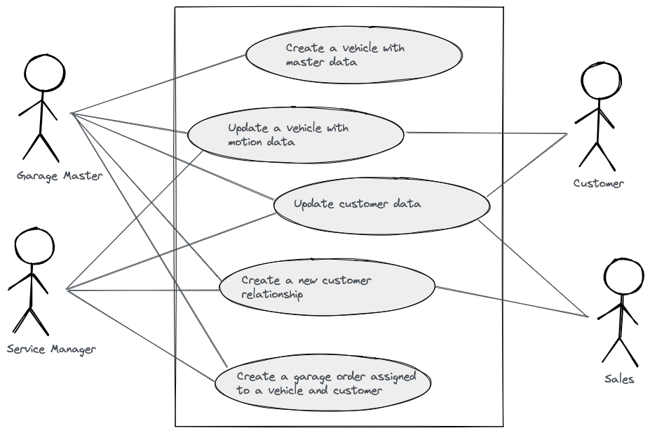

# Lab 3: Interface Segregation Principle and the Ports & Adapters Pattern

## Mappings Between Boundaries

Currently the _Vehicle_ is the model of the application, and it is not separated from infrastructure. In conclusion the
idea of ports and adapters is not consequently followed. The missing element to fully decoupled domain and
infrastructure is a _mapping between these boundaries_.

---
**Mapping**

Mappings between boundaries describes a transformation of the state of a source entity model to an target entity model.
The following code snippets shows an example of different entity model, where for example the _baumuster_ of _
VehicleResponse_ must be mapped on the the property _modelDescription_ of _Vehicle_.

```java
public class Vehicle {

    public String modelDescription;

    public String vin;

    public Double mileage;

}
```

```java
public class VehicleResponse {

    public String baumuster;

    public String vehicleId;

    public Double mileage;

}
```

---
**Pro mapping**

* If we don't map between layers, we have to use the same model on both layers, which means that the layers will be
  tightly coupled.
* Mappings enables use (1) to reduce the amount of data from external models and (2) implement a model in our domain
  language, which (3) is easier to understand and (4) extend.

---
**Contra mapping**

* If we do map between layers, we produce a lot of boilerplate code, which is overkill for many use cases.

---

All arguments are true. We have to consider our software architecture goals for this decision. Our goals are to create

1) a isolated domain, and
2) source code that expresses the domain functionality and language cyrstal clear

A key element to reach this is mapping. But a good balance between boilerplate code and decoupling can be reached by
simplifying and automation of mappings as well as using the so-called _two-way mapping strategy_.

### Data Transfer Objects Between Layers

The class-stereotype <i>Data Transfer Object</i> described data objects provided by infrastructure components. In
detail <i>Data Transfer Object</i> can be a:

* _DbEntity_
* _Event_
* _Resource_
* _Response Object_
  and so on

### Benefits of Mappings

---
**Stable domain and fast adaption**

Changes in the infrastructure affect not the domain. When for example an external service changes its response model
then the changes affect only the mapping part of the adapter implementation. This single point of change enables us to
adapt very fast to changes in the infrastructure.

In addition to that, it is possible to reduce test efforts. There are no tests of the domain needed when nothing
changed. The adapter implementation could be tested in isolation on a pure technical level, which is less complex and
cost-intensive.

---
**Evolutionary design**

Change comes fast and unexpected. But for sure - it comes! Domain-related change could arise due to

* changing behavoiur,
* new requirements,
* growing buiness model,
* changing business model,
* new consumers, and so on.

Since we cannot foresee change, we must look ahead and act. On an architectural level, this means that we have to apply
architecture and design principle that enables change.

The idea of ports and adapters is a powerful pattern to support change based on the decoupling of domain and
infrastructure. Each of them can grow and modernize independently. Combined with the interface segregation principle
flexibility in functionality as well as testability can be maximized.

## Task 3.1: Introduce a DbEntity

1. Create the class <i>VehicleDbEntity</i> and place it in the designated package
2. Ignore framework specific annotations

```java

public class VehicleDbEntity {

    //id
    private String vin;

    //...

    public Vehicle() {
    }

    //getter and setter
}

```

### Verify your implementation

1. Move the test _DbEntityTestExercise3_1.java_ from _exercises/tests/three/one_ to _
   src/test/java/com/daimler/dcp/clean/arc/demo/exercise/three/one_
2. Run _mvn clean install -DskipTests_
3. Execute _DbEntityTestExercise3_1.java_

### Verify Your Architecture

1. Move the test _DbEntityArchitectureTestExercise3_1.java_ from _exercises/tests/three/one_ to _
   src/test/java/com/daimler/dcp/clean/arc/demo/exercise/three/one_
2. Run _mvn clean install -DskipTests_
3. Execute _DbEntityArchitectureTestExercise3_1.java_

## Task 3:2: Extend the VehicleRepository and Solve the Compilation Error

1. Add the private method _findVehicleDbEntity_ to _VehicleRepository_ which returns a hard coded _VehicleDbEntity_
2. Use _findVehicleDbEntity_ in the existing public method _findVehicleByVin_ and replace the hard code _Vehicle_
   creation

```java

private VehicleDbEntity findVehicleDbEntity{ //... }

```

As a result you have a compiltation error.

Remember the responsibilities of the class stereotype repository. Which source code elements do you expected in the
class _VehicleRepository_? **Make a list**.

[Solution](Exercise3-repository-solution.md)

Introduce a class-stereotype to solve the problem following the principles of clean architecture.
_(The domain should not depend on infrastructure!)_

[Solution](./Exercise3-solve-the-compilation-error-solution.md)

### Verify your implementation

1. Now there must come up a compilation error in _RepositoryTestExercise2_3.java_.
2. Fix the compilation error and execute _RepositoryTestExercise2_3.java_ again.

[Solution](Exercise3-extend-the-repository-test.md)

### Verify Your Architecture

1. Move the test _ArchitectureTestExercise2_3.java_ from _exercises/tests/two/one_ to _
   src/test/java/com/daimler/dcp/clean/arc/demo/exercise/two/one_
2. Run _mvn clean install -DskipTests_
3. Execute _ArchitectureTestExercise2_3.java_

## Slicing Use Cases with the Interface Segregation Principle

_Robert C. Martin_ points out in his book _Clean Architecture_ that "depending on something that carries baggage that
you don't need can cause you trouble that you didn't expect"!

The Interface Segregation Principle provides an answer to this problem. It states that broad interfaces should be split
into specific ones so that clients only know the methods they need.

Applying the Interface Segregation Principle

* **removes unnecessary dependencies** to methods the consumer doesn't need,
* makes the existing **dependencies more visible**,
* **prevents** potentical trouble in sense of **side effects** due to change in the software and,
* enables **flexibility** by <b>extendibility</b> (e.g. new interfaces and functionality can be introduce without
  affecting existing interfaces and functionality as well as **fast adaption** (interfaces with small responsibilities
  are less complex, easier to change and to test)

In origin sense the Interface Segregation Principle says:

---
Many client-specific interfaces are better then one general-purpose interface. No clients should be forced to depend on
methods it does not use. In conclusion, interfaces should be separated into small responsibilities as minimalistic as
possible.


Personally I do not use the option _Root Entity_. As a default I use the option _Command & Query_. When different
consumer exists and there are difference between their needs, the I recommend to use the option _one method per
usecase (port)_. Also refering to the package structure variants, there is a separation of incoming and outgoing use
cases, which is recommended to apply as standard design principle.

Following code examples for different variants of slicing use cases.

**Use cases by Root Entity**

```java

public interface VehicleUseCase {

    Vehicle readByVin(Vin vin);

    Vehicle readByLicensePlate(LicensePlate licensePlate);

    Vehicle update(Vin vin, VehicleMotionData vehicleMotionData);

    Vehicle create(Vehicle vehicle);

    void delete(Vin vin);
}
```

**Use case by separating command and query***

```java

public interface VehicleQuery {

    Vehicle readByVin(Vin vin);

    Vehicle readByLicensePlate(LicensePlate licensePlate);
}
```

```java

public interface VehicleCommand {

    Vehicle update(Vin vin, VehicleMotionData vehicleMotionData);

    Vehicle create(Vehicle vehicle);

    void delete(Vin vin);
}
```

Separating in command and query prevents classes that grows to complex and big units of source code that are hard to
understand. A good orientation for modularisation inside a domain module can be found in command and query, even when
you not plan to apply the Command Query Segregation Principle. But there is good foundation if this design decision
changes over time.

It is also I good idea of several clients only need read access. Than there is no reason do depend on command-methods.

**One method per use case (port)***

```java
public interface ReadVehicleByVin {

    Vehicle read(Vin vin);
}
```

```java
public interface ReadVehicleByLicensePlate {

    Vehicle read(LicensePlate licensePlate);
}
```

```java
public interface CreateVehicle {

    Vehicle readByVin(Vin vin);

    Vehicle readByLicensePlate(LicensePlate licensePlate);
}
```

```java
public interface UpdateVehicle {

    Vehicle update(Vin vin, VehicleMotionData vehicleMotionData);
}
```

```java
public interface DeleteVehicle {

    void delete(Vin vib);
}
```

Even if this variant is perhaps untypical for Java, slicing use cases per method reduces coupling between clients, what
means the overal coupling between components of the software system will be keep low. Coupling will rise quickly and
unavoidable. Due to this we should avoid it every time when possible in fast growing software system for complex
business domains.

Small sliced use cases allows to assemble these use cases to a higher composition of functionality. Based on this,
functionality can be extended fast and flexible for new or changing business proceses or user group specific
requirements.

### Slicing Use Cases in Practice

There is no right way by default. It depend on complexity and requirements of the specific use case. In pratice a
reasonable combination of these variants is may the best way to find a good balance between flexibility and simplicitity
in the architecture in the longterm.

Let's have a look on following functional requirements. As we already know, we have the mission to build a great garage
management that is maintainable, extendable and flexible. We want to modernize existing business processes and establish
new business models. And the system now starts to live and we can expected an evolution over the years because the
digtized business model change of time due to changing requirements of the stakeholder and also technical evolution
which creates the need of modernization over time.

Slicing use case makes a typical problem of architects' visible. In the moment of defining specific use cases, for
example read, create or update a vehicle, the complexitiy and arguments for slicing fine-grained use cases is not
obvouisly. So may there is some resistance against this design approach in your team. Another example is the mapping,
which often felt to be too much.

### The Broken Window Theory

TODO: Add

## More Insight About our Domain Garage Management

TODO: Add explaination



To summarize:

1. There exist different actors with different authorizations within the application. For example, creating a new
   vehicle can only be performed by a garage master.
2. The described overall functionality leads to several components in the software. The important question is, how can
   we design the dependency between the components in a loosley coupled manner.

### Task 3.2: Extend the Domain and the Input Adapter

#### Task 3.2.1: Extend the Root Entity Vehicle

...

Implement the following class diagram for the root entity _Vehicle_.


Ensure that the _Vehicle_ can only be created with the mandatory properties. Mandatory properties are:

* VehicleMotionData
* VehicleMasterData
* Vin

Ignore the inner properties of this domain objects in the first step.

There is a small side effect that must be adapted. Replace the method _createExpectedVehicle_
in the class _BaseExerciseTest_ with following code snippet:

```java
protected Vehicle createExpectedVehicle(){
        return new Vehicle(new Vin(VIN),
        new VehicleMotionData(
        new LicensePlate("ES-EM 385"),
        new Mileage(100000,MileageUnit.KM),
        new RegistrationCountry("DE")
        ),
        new VehicleMasterData(
        new ArrayList<Equipment>(),
        new VehicleModel("E30 Limousine","3er"),
        new SerialNumber("1")
        )
        );
        }
```

#### Task 3.2.2: Extend the VehicleController with a Resource and a Mapper

Now a compilation error occur in the _VehicleController_. Think about how you could solve this problem? To find a
solution the is confirm to clean architecture pattern all principles and patterns are already discussed.

[Solution](Exercise3-extend-controller-with-resource-and-mapper.md)

#### Verify Your Implementation

##### Verify Your Controller

1. Now there must come up a compilation error in _ControllerTestExercise2_1.java_
2. Fix the creation of the _VehicleController_
3. Replace the assertion in line 21 with

```java
   assertThat(vehicle.getVin()).isEqualTo(createExpectedVehicle().vin().value());
```

3. Execute _ControllerTestExercise2_1.java_

[Solution](Exercise3-extend-the-controller-test.md)

##### Verify Your Individual Solution Strategy

1. VehicleToVehicleResourceMapper ...
2. ...

[Solution](./Exercise3-verify-the-individual-solution-strategy.md)

#### Verify Your Architecture

TODO: Input Adapter und Mapper

1. Move the test _ArchitectureTestExercise2_3.java_ from _exercises/tests/two/one_ to _
   src/test/java/com/daimler/dcp/clean/arc/demo/exercise/two/one_
2. Run _mvn clean install -DskipTests_
3. Execute _ArchitectureTestExercise2_3.java_

#### Optional: Make Your Domain Objects Self-validating

...

##### Verify Your Implementation

1. Now there must come up a compilation error in _ControllerTestExercise2_1.java_.
2. Fix the compilation error and execute _ControllerTestExercise2_1.java_ again.

[Solution](Exercise3-extend-the-controller-test.md)

##### Verify Your Architecture

1. Move the test _ArchitectureTestExercise2_3.java_ from _exercises/tests/two/one_ to _
   src/test/java/com/daimler/dcp/clean/arc/demo/exercise/two/one_
2. Run _mvn clean install -DskipTests_
3. Execute _ArchitectureTestExercise2_3.java_

### Task 3.3: Add the Use Cases Create and Update

Create a incoming use case called _VehicleCommand_ with the following methods:

```java

Vehicle create(Vehicle vehicle);
        Vehicle update(Vin vin,VehicleMotionData vehicleMotionData);

```

and place it in the designated package.

#### Verify Your Architecture

TODO: Add test UseCase In und Service

1. Move the test _ArchitectureTestExercise2_2.java_ from _exercises/tests/two/two_ to _
   src/test/java/com/daimler/dcp/clean/arc/demo/exercise/two/two_
2. Run _mvn clean install -DskipTests_
3. Execute _ArchitectureTestExercise2_2.java_

### Task 3.4: Extend the VehicleRepository Including Outgoing Use Case(s)

To persist vehicle objects into a database, we need to extend our adapter implementation with this functionality.

```java

Vehicle save(Vehicle vehicle);

```

#### Verify Your Implementation

TODO Test für VehicleDbCommand, VehicleDbMapper, Repository, Architecture UseCase

1. Move the test _ArchitectureTestExercise2_3.java_ from _exercises/tests/two/one_ to _
   src/test/java/com/daimler/dcp/clean/arc/demo/exercise/two/one_
2. Run _mvn clean install -DskipTests_
3. Execute _ArchitectureTestExercise2_3.java_

#### Verify Your Architecture

1. Move the test _ArchitectureTestExercise2_3.java_ from _exercises/tests/two/one_ to _
   src/test/java/com/daimler/dcp/clean/arc/demo/exercise/two/one_
2. Run _mvn clean install -DskipTests_
3. Execute _ArchitectureTestExercise2_3.java_

### Task 3.5: Implement the Use Cases Create and Update

Extend the _VehicleService_ by implementing the _VehicleCommand_ use case. Including also the corresponding outgoing use
case as dependency to save vehicle objects into the database.

#### Verify Your Implementation

TODO Test für VehicleDbCommand, VehicleDbMapper, Repository, Architecture UseCase

1. Move the test _ArchitectureTestExercise2_3.java_ from _exercises/tests/two/one_ to _
   src/test/java/com/daimler/dcp/clean/arc/demo/exercise/two/one_
2. Run _mvn clean install -DskipTests_
3. Execute _ArchitectureTestExercise2_3.java_

#### Verify Your Architecture

1. Move the test _ArchitectureTestExercise2_3.java_ from _exercises/tests/two/one_ to _
   src/test/java/com/daimler/dcp/clean/arc/demo/exercise/two/one_
2. Run _mvn clean install -DskipTests_
3. Execute _ArchitectureTestExercise2_3.java_

#### Additonal Questions

Which neccessary tasks can occur on the code level? What belongs to the domain or and how would you design and implement
it? Make a brainstorming.

[Solution](./Exercise3-solve-the-compilation-error-solution.md)

#### Verify Your Implementation

1. Move the test _ArchitectureTestExercise2_3.java_ from _exercises/tests/two/one_ to _
   src/test/java/com/daimler/dcp/clean/arc/demo/exercise/two/one_
2. Run _mvn clean install -DskipTests_
3. Execute _ArchitectureTestExercise2_3.java_

#### Verify Your Architecture

1. Move the test _ArchitectureTestExercise2_3.java_ from _exercises/tests/two/one_ to _
   src/test/java/com/daimler/dcp/clean/arc/demo/exercise/two/one_
2. Run _mvn clean install -DskipTests_
3. Execute _ArchitectureTestExercise2_3.java_

### Task 3.6: Implement the Create and Update REST Interfaces

TODO ...

#### Verify Your Implementation

1. Now there must come up a compilation error in _ControllerTestExercise2_1.java_.
2. Fix the compilation error and execute _ControllerTestExercise2_1.java_ again.

[Solution](Exercise3-extend-the-controller-test-2.md)