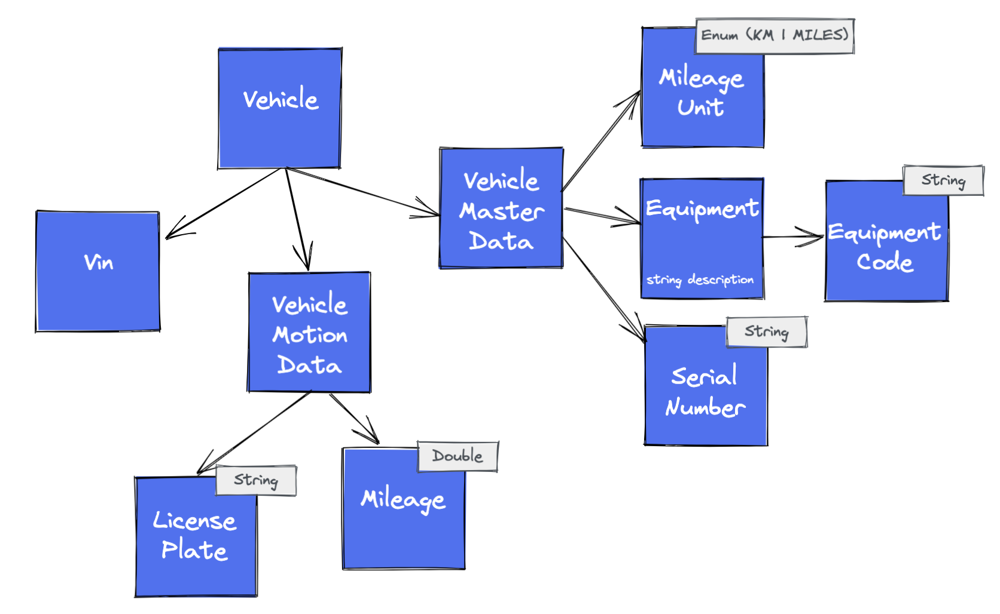
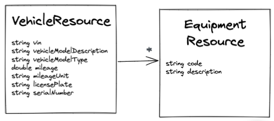
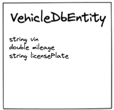

# Lab 4: Growing Domain Part 1

## Task 4.1: Implement the Domain Model

Implement the additional domain objects that belongs to the root entity _Vehicle_, like described in the following uml
class diagram.

Implement the following self-validation domain objects:

| Domain object |               Validation Rule                |
| ------- |:--------------------------------------------:|
|LicensePlate|[A-ZÖÜÄ]{1,3}-[A-ZÖÜÄ]{1,2} [1-9]{1}[0-9]{1,3}| 
|EquipmentCode|               [A-Z]{2}[0-9]{3}               |         
|Mileage|       no negative value (mileage >= 0)       |

Investigate and understand the whole root entity _Vehicle_.

Following rules are given for creating a _Vehicle_ object:

| Domain object | Validation Rule|
| ------------- |:--------------:|
|VehicleMotionData| All fields are mandatory, all values must fulfil the validation rules |
|Vehicle| Needs a valid vin and valid vehicle motion data |

### Verify your Implementation

1. Move the tests _DomainRing_Task_4_1.java_ _tutorial/lab/four_ to _
   src/test/java/com/hexaclean/arc/demo/lab/four_
2. Run _mvn clean install -DskipTests_
3. Execute _DomainRing_Task_4_1.java_

### Verify Your Architecture

Execute _ArchitectureTest_Task_4_1.java_

## Task 4.2: Extend the VehicleResource and the Mapper

Extend the _VehicleResource_ like described as follows and adapt the _VehicleController_ and the _
VehicleToVehicleResourceMapper_.

### Verify your Implementation

1. Move the tests _InputAdapter_Task_4_2.java_ _tutorial/lab/four_ to _
   src/test/java/com/hexaclean/arc/demo/lab/four_
2. Run _mvn clean install -DskipTests_
3. Execute _InputAdapter_Task_4_2.java_

### Verify Your Architecture

Execute all architecture tests

## Task 4.3: Introduce the VehicleMasterDataServiceClient

There are some constraints given by the company context. There is one central place for vehicle master data. From this
source needed master data must be queried.

Due to this you have to introduce the _VehicleMasterDataServiceClient_ and create the adapter implementation with the
name _VehicleMasterDataToVehiceDtoMapper_. For this task the external data object _VehicleDataDto_ (package 
_vehicle/adapter/out/dto_) and the outgoing use case FetchVehicleMasterData (package _vehicle/usecase/out_) already
exists.

The external API returns returns a lot of information we do not need in our domain. This is visible in the _
VehicleDataDto_ class. For example the property
_salesRelatedInformation_ is not neccessary for our domain.

Due to this we only extract the properties we defined in the
_VehicleMasterData_ domain object. Have a look at the _VehicleDataDto_ and implement the service client and mapper.

### Verify your Implementation

1. Move the tests _OutputAdapter_Task_4_3.java_ _tutorial/lab/four_ to _
   src/test/java/com/hexaclean/arc/demo/lab/four_
2. Run _mvn clean install -DskipTests_
3. Execute _OutputAdapter_Task_4_3.java_

### Verify Your Architecture

Execute all architecture tests

## Task 4.4: Extend the VehicleDbEntity and the Mapper

In the own database we store the vehicle motion data and other informations that not belongs to vehicle master data.

Extend the _VehicleDbEntity_ and the _VehicleToVehicleDbEntityMapper_ as described in the diagram.

### Verify your Implementation

1. Move the tests _OutputAdapter_Task_4_4.java_ _tutorial/lab/four_ to _
   src/test/java/com/hexaclean/arc/demo/lab/four_
2. Run _mvn clean install -DskipTests_
3. Execute _OutputAdapter_Task_4_4.java_

### Verify Your Architecture

Execute all architecture tests

## Task 4.5 Extend the VehicleService

Extend the _VehicleService_ so that

* vehicle motion data will be queried from database, and
* vehicle master data will be queried from a external API

Implement the orchestration of different outgping use case like described in following sequence diagram:

ADD DIAGRAM

### Verify your Implementation

1. Move the tests _OutputAdapter_Task_4_5.java_ _tutorial/lab/four_ to _
   src/test/java/com/hexaclean/arc/demo/lab/four_
2. Run _mvn clean install -DskipTests_
3. Execute _OutputAdapter_Task_4_5.java_

### Verify Your Architecture

Execute all architecture tests
