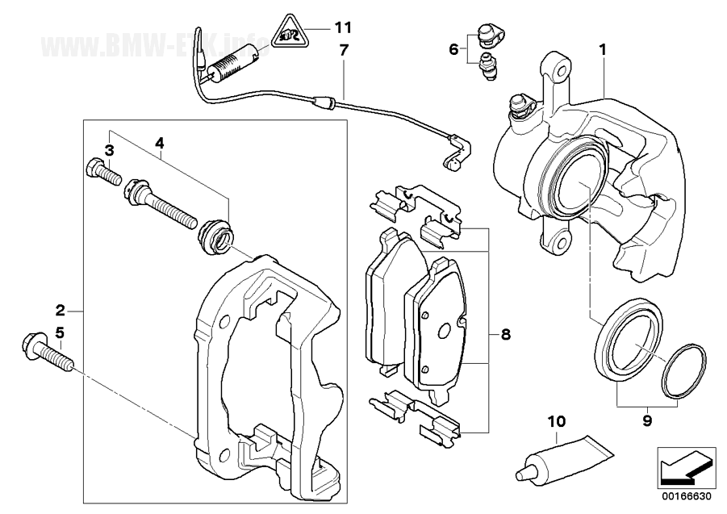
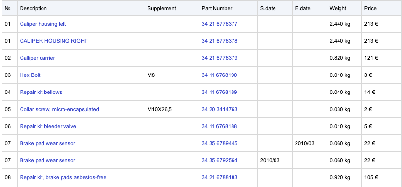

# Lab 6: Growing Domain Part 3

## New Domain Modules

Let's have a look on the introduced domain modules _GarageOrder_ and _PartsCatalogue_. Both domain modules depends on
the _Vehicle_ domain module.

In context of the garage order only 
* the license plate and, 
* the mileage 

are relevant. 
 
For the parts catalogue only 
* the vin, 
* the vehicle model and, 
* the domain value _has2GSupport_ 

are from importance.

See the garage order form for more details:


See also a sample explosion chart as central domain object of the parts catalogue:



Additional the corresponding spare parts table.



## Design Dependencies Between Domain Modules

In traditional data-centric approach it is common to design the application around a centric data model. But we learned
that this leads to high coupling in the long term. Sharing the domain objects can be a valid solution with the discussed
disadvantages.

In this lab we meet three alternative solution strategies to handle dependencies between domain modules.

## Task 6.1: Introduce the Use Case FetchVehicleByLicensePlate

1. Introduce a additional incoming use case in the domain module _Vehicle_ with the name _FetchVehicleByLicensePlate_ that
   contains the following method:

**Java**
```java
Vehicle fetchByLicensePlate(Vin vin);
```
**Kotlin**
```kotlin
fun fetchByLicensePlate(vin: Vin): Vehicle;
```
**C#**
```java
Vehicle FetchByLicensePlate(Vin vin);
```

2. Implement the use case by extending the _VehicleQueryService_

### Verify your Implementation

**RUN** _DomainRing_Task_6_1_

### Verify Your Architecture

**Java & Kotlin**

**RUN**  _ArchitectureTest_Task_6_1_

**C#**

**RUN** all architecture tests

## Task 6.2: Implement the Adapter.Out - UseCase.In Pattern

Implement the adapter.out - usecase.in pattern between the domain module _garage order_ and _vehicle_.

1. Have a look at the outgoing use case _FetchVehicle_ in _garage/order/usecase/out_
2. Implement the output adapter with the name _VehicleModuleClient_ and a mapper with the name 
_VehicleToOriginVehicleMapper_.

### Verify your Implementation

**RUN** _OutputAdapter_Task_6_2.java_

### Verify Your Architecture

**Java & Kotlin**

**RUN** _ArchitectureTest_Task_6_2_

**C#**

**RUN** all architecture tests

## Task 6.3: Implement the Application Service Pattern

Implement the application service pattern between the domain module _parts catalogue_ and _vehicle_.

1. Have a look at the _ExplosionChartApplicationService_ in _parts/catalogue/appservice_ and notice the dependency to
_VehicleQuery_ of the domain module vehicle.
2. Implement a mapper with the name _VehicleToOriginVehicleMapper_
3. Implement the use case _ExposionChartQuery_ 
4. Use _VehicleQuery_ to fetch necessary vehicle data

### Verify your Implementation

**RUN** _ApplicationService_Task_6_3_

### Verify Your Architecture

**Java & Kotlin**

**RUN** _ArchitectureTest_Task_6_3_

**C#**

**RUN** all architecture tests

##  (Optional) Task 6.4: Clean Architecture Fitness Functions

**Java & Kotlin**

1. **RUN** _CleanArchitectureTest.java_
2. Fix the test by extending the test _should_check_clean_architecture_all_rings_architectural_expressive_ with this two lines of code:

```java
        .adapterOutOfAdapterOutUseCaseInPattern("..garage.order.adapter.out..")
        .applicationService("..parts.catalogue.appservice..")
```
3. **RUN** _CleanArchitectureTest_ again


## Group Discussion: Use the Supporting Service Pattern Between Vehicle and Parts Catalogue

See _src/test/java/com/hexaclean/arc/demo/supporting/service/vehicle/masterdata_.